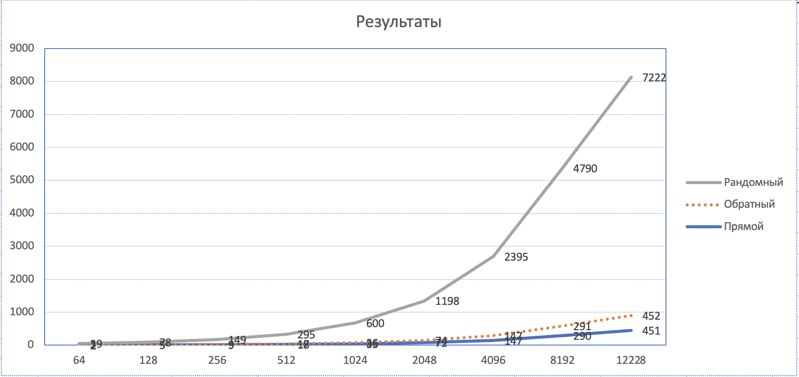

- investigation:
- travel_variant: direction
    - experiments:
      - experiment:
        - number: 1                
        - input_data: 
          - buffer_size: "64kb"               
        - results:                                       
          - duration: 2ms
      - experiment:
        - number: 2
        - input_data:
          - buffer_size: "128kb"
        - results:
          - duration: 5ms               
      - experiment:
        - number: 3
        - input_data:
          - buffer_size: "256kb"
        - results:
          - duration: 9ms              
      - experiment:
        - number: 4
        - input_data:
          - buffer_size: "512kb"
        - results:
          - duration: 18ms               
      - experiment:
        - number: 5
        - input_data:
          - buffer_size: "1mb"
        - results:
          - duration: 35ms
      - experiment:
        - number: 6
        - input_data:
          - buffer_size: "2mb"
        - results:
          - duration: 72ms               
      - experiment:
        - number: 7
        - input_data:
          - buffer_size: "4mb"
        - results:
          - duration: 147ms               
      - experiment:
        - number: 8
        - input_data:
          - buffer_size: "8mb"
        - results:
          - duration: 290ms               
      - experiment:
        - number: 9
        - input_data:
          - buffer_size: "12mb"
        - results:
          - duration: 451ms        
          

- travel_variant: reverse
  - experiments:
    - experiment:
      - number: 1
      - input_data:
        - buffer_size: "64kb"
      - results:
        - duration: 2ms
    - experiment:
      - number: 2
      - input_data:
        - buffer_size: "128kb"
      - results:
        - duration: 5ms
    - experiment:
      - number: 3
      - input_data:
        - buffer_size: "256kb"
      - results:
        - duration: 9ms
    - experiment:
      - number: 4
      - input_data:
        - buffer_size: "512kb"
      - results:
        - duration: 17ms
    - experiment:
      - number: 5
      - input_data:
        - buffer_size: "1mb"
      - results:
        - duration: 36ms
    - experiment:
      - number: 6
      - input_data:
        - buffer_size: "2mb"
      - results:
        - duration: 74ms
    - experiment:
      - number: 7
      - input_data:
        - buffer_size: "4mb"
      - results:
        - duration: 147ms
    - experiment:
      - number: 8
      - input_data:
        - buffer_size: "8mb"
      - results:
        - duration: 291ms
    - experiment:
      - number: 9
      - input_data:
        - buffer_size: "12mb"
      - results:
        - duration: 452ms

- travel_variant: random
  - experiments:
    - experiment:
      - number: 1
      - input_data:
        - buffer_size: "64kb"
      - results:
        - duration: 39ms
    - experiment:
      - number: 2
      - input_data:
        - buffer_size: "128kb"
      - results:
        - duration: 78ms
    - experiment:
      - number: 3
      - input_data:
        - buffer_size: "256kb"
      - results:
        - duration: 149ms
    - experiment:
      - number: 4
      - input_data:
        - buffer_size: "512kb"
      - results:
        - duration: 295ms
    - experiment:
      - number: 5
      - input_data:
        - buffer_size: "1mb"
      - results:
        - duration: 600ms
    - experiment:
      - number: 6
      - input_data:
        - buffer_size: "2mb"
      - results:
        - duration: 1198ms
    - experiment:
      - number: 7
      - input_data:
        - buffer_size: "4mb"
      - results:
        - duration: 2395ms
    - experiment:
      - number: 8
      - input_data:
        - buffer_size: "8mb"
      - results:
        - duration: 4790ms
    - experiment:
      - number: 9
      - input_data:
        - buffer_size: "12mb"
      - results:
        - duration: 7222ms

        
